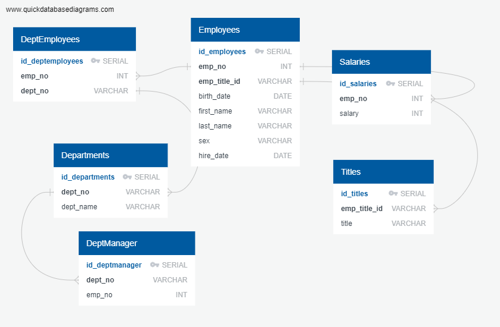

## This assignment consists of three parts 
    1) Data Modeling
    2) Data Engineering
    3) Data Analysis

Data Modeling   
    First we need to establish the ERD to understand how it will be possible to analyze the data.  The ERD diagram displays how the tables are able to be linked together by the various measures.  I established a primary key for each table by using a serial counter

Data Engineering
    In addition to each table having serial primary key I also labeled a value unique when there were not duplicates for that column within the data set. 
    I created the tables using the code in the table_setup_schema.sql file before importing each of the corresponding CSV files
    When importing the CSV files I made sure to check headers and remove the primary key serial columns from the data upload.  This ensured data columns would be imported in with the accurate column headers in the tables that were set up

Data Analysis
    Once all of the data is imported I could begin the analysis:

    1) List the employee number, last name, first name, sex, and salary of each employee.
        query: data_analysis_1.sql
        explanation: To get all of the information selected I needed to join the Employees and Salaries table on the employee number, then I could display employee number, last name, first name and sex from the employee table and salary from the salary table by using the employee number as the linking identifier.

    2) List the first name, last name, and hire date for the employees who were hired in 1986.
        query: data_analysis_2.sql
        explanation: The Employees table contained all of the information for this specific query.  I selected first name, last name and hire date from the Employees table and set a criteria where the hire date with equal to or inbetweeen 1/1/1986 and 12/31/1986.

    3) List the manager of each department along with their department number, department name, employee number, last name, and first name.
        query: data_analysis_3.sql
        explanation: Three tables were needed to query the needed data.  I joined Department Manager and Departments tables on department number.  I joined Department Manager and Employees tables on employee number.  I was then able to display the required measures from one of the three tables.

    4) List the department number for each employee along with that employee’s employee number, last name, first name, and department name.
        query: data_analysis_4.sql
        explanation: To get to the required measures I needed to join three different tables.  I executed this by joining Depmartment Employees and Departments on department number and Department Employees and Employees on employee number.  I was then able to display the full list of departments and employees from the Department Employees table and bring in the first name and last name from the Employees table and the department name from the Departments table.

    5) List first name, last name, and sex of each employee whose first name is Hercules and whose last name begins with the letter B.
        query: data_analysis_5.sql
        explanation: I was able to execute this query only using the Employees table.  I selected first name, last name and sex and filter where the first name was equal to Hercules and using the LIKE and wildcard funcation filtered to last names that started with B.

    6) List each employee in the Sales department, including their employee number, last name, and first name.
        query: data_analysis_6.sql
        explanation: All of the display information came from the Employees table, however to filter to employees just in the sales department I had to join the Department Employees table and Departments Table.  The Department Employees and Employees were joined on employee number and the Departments and Department Employees tables were joined on teh department number.  
        

    7) List each employee in the Sales and Development departments, including their employee number, last name, first name, and department name.
        query: data_analysis_7.sql
        explanation: This query is an exact replica of the above query, but also includes Development in the department name filter.  Returning all results for employees that are employeed in either the Sales or Development department.

    8) List the frequency counts, in descending order, of all the employee last names (that is, how many employees share each last name).
        query: data_analysis_8.SQL
        explanation: This query displays the last name and counts the frequency in which that last name occurs.  It displays the last name only once by using the group by function and it displays the count in descending order by using the order by descending function.
